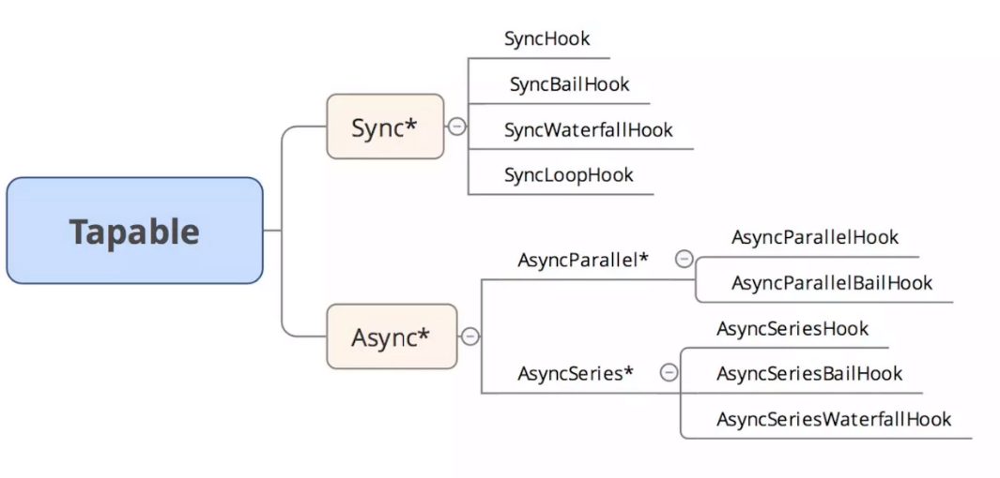
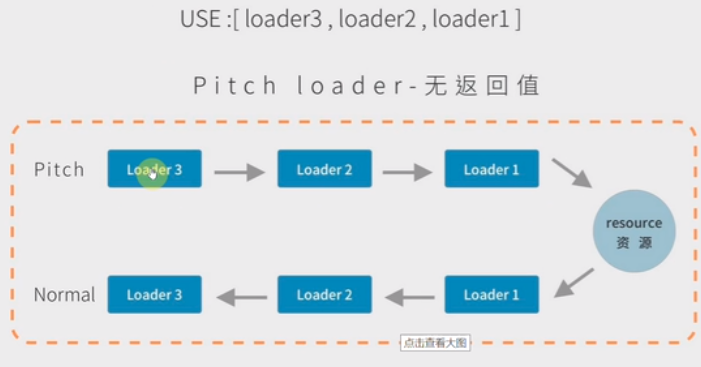
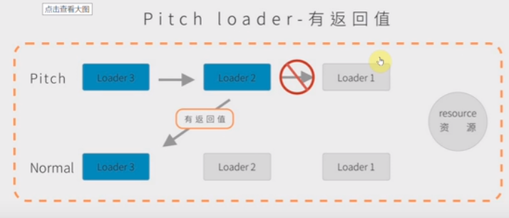

# webpack

视频地址：https://www.bilibili.com/video/av51693431

>
> 代码转换、文件优化、代码分割、模块管理、自动刷新、代码检验、自动发布
>
## 1 掌握内容

+ webpack 常见配置
+ webpack 高级配置
+ webpack 优化策略
+ ast 抽象语法树
+ webpack 中的 Tapable
+ 掌握 webpack 流程、手写 webpack
+ 手写 webpack 中常见的 loader
+ 手写 webpack 中常见的 plugins

## 2 webpack 常见配置

### 2.2 配置

```js
// webpack.config.js
const path = require('path')
module.exports = {
  mode: 'development', // development production(该模式下回自动压缩代码)
  entry: path.join(__dirname, './src/index.js'),
  output: {
    filename: 'bundle.[hash:8].js',
    path: path.join(__dirname, './build'),
  }
}
```


#### 2.2.1 自定义打包配置文件

```js
// webpack.config.xxx.js
module.exports = {
  // ...
}

// 执行命令
// npx webpack --config webpack.config.xxx.js
```


#### 2.2.2 配置脚本

```json
{
  "scripts": {
    "dev": "webpack-dev-server --config webpack.config.js --colors",
    "build": "webpack --config webpack.config.js --colors"
  }
}
```


### 2.3 常用插件

`webpack-dev-server`

`cnpm i webpack-dev-server -D `

```json
devServer: {
    port: 8081,
    progress: true, // 进度条
    contentBase: './build', // 指定 build 文件夹作为静态服务
    compress: true // 压缩文件
}
```

`html-webpack-plugin - 打包 html 页面：`

`cnpm i html-webpack-plugin -D`

```js
const HtmlWebpackPlugin = require('html-webpack-plugin')
module.exports = {
  // ...
  plugins: [
    new HtmlWebpackPlugin({
      template: './src/index.html',
      filename: 'index.html',
      minify: {
        removeAttributeQuotes: true, // 删除双引号
        collapseWhitespace: true // 折叠空行
      },
      hash: true // 添加 hash 戳
    })
  ]
  // ...
}
```


`css less loader` 配置

`cnpm i css-loader less less-loader mini-css-extract-plugin postcss-loader style-loader url-loader -D`

```js
const MiniCssExtractPlugin = require("mini-css-extract-plugin")
module.exports = {
  // ...
  plugins: [
    new MiniCssExtractPlugin({
      filename: path.posix.join('static', 'css/[name].[contenthash].css'),
      // disable: false,  //是否禁用此插件
      // allChunks: true,
      // publicPath: '',
      options: {
        insert: 'head'
      }
    })
  ],
  module: {
    rules: [
      { // css
        test: /\.css$/,
        use: [
          {
            loader: MiniCssExtractPlugin.loader,
            options: {
              // localIdentName:'[name]-[local]-[hash:base64:6]',
              publicPath: '../../'
            }
          },
          {
            loader: 'css-loader',
            options: {
              url: true,
              modules: {}
            }
          },
          'postcss-loader'
        ]
      },
      { // less
        test: /\.less$/,
        use: [
          {
            loader: MiniCssExtractPlugin.loader,
            options: {
              publicPath: '../../'
            }
          },
          {
            loader: 'css-loader',
            options: {}
          },
          'less-loader',
          'postcss-loader'
        ]
      },
    ]
  }
  // ...
}
```


`postcss.config.js`

```js
module.exports = {
  plugins: {
    'autoprefixer': {
      overrideBrowserslist: 'last 5 version'
    }
  }
}
```


> `postcss-loader` 配合`autoprefixer`给样式加前缀。

`打包 JS CSS 压缩优化：`

```js
const OptimizeCSSAssetsPlugin = require('optimize-css-assets-webpack-plugin') // 用于优化\最小化CSS
const TerserJSPlugin = require('terser-webpack-plugin') // js 压缩

module.exports = {
  // ...
  optimization: {
    minimize: true,
    minimizer: [
      new TerserJSPlugin({
        cache: true, // 是否缓存
        parallel: true, // 并发打包
        sourceMap: true,
      }),
      new OptimizeCSSAssetsPlugin({
        cssProcessorPluginOptions: {
          preset: ['default', { discardComments: { removeAll: true } }],
        },
        cssProcessorOptions: {
          safe: true
        }
      })
    ]
  },
  // ...
}
```


### 2.4 `ES6` 语法转换

`cnpm i @babel/preset-env @babel/plugin-proposal-decorators @babel/plugin-proposal-class-properties @babel/plugin-transform-runtime -D`

`cnpm i @babel/runtime -S`

> `@babel/polyfill` 已弃用，参看：[core-js@3带来的惊喜](https://www.cnblogs.com/sefaultment/p/11631314.html)、[corejs](https://babeljs.io/docs/en/babel-plugin-transform-runtime#corejs)

```js
require("core-js-pure/stable")
require("regenerator-runtime/runtime")

module.exports = {
  // ...
  module: {
    rules: [
      {
        test: /\.js$/,
        use: {
          loader: 'babel-loader',
          options: {
            presets: [ // 预设
              ["@babel/preset-env", {
                "useBuiltIns": "usage",
                "targets": {
                  "chrome": "58",
                  "ie": "11"
                }
              }]
            ],
            plugins: [
              ['@babel/plugin-proposal-decorators', {'legacy': true}], // 装饰器
              ['@babel/plugin-proposal-class-properties', {'loose': true}], // Class
              "@babel/plugin-transform-runtime"
            ]
          }
        },
        include: path.resolve(__dirname, 'src'),
        exclude: /node_modules/
      },
    ]
  }
  // ...
}
```


### 2.5 代码规范

`cnpm i eslint eslint-loader -D`

```js
// webpack.config.js
module.exports = {
  // ...
  module: {
    rules: [
      {
        test: /\.js$/,
        enforce: 'pre', // previous post，在mormal loader 前置执行
        use: {
          loader: 'eslint-loader',
          options: {
            cache: true,
            fix: true // ESLint自动修复功能
          }
        },
        enforce: 'pre', // previous post
        exclude: /node_modules/
      }
    ]
  }
  // ...
}
```


[官方配置地址](https://eslint.org/demo) => `Rules Configuration`

```js
// .eslintrc.json
{
  "parserOptions": {
      "ecmaVersion": 11,
      "sourceType": "module",
      "ecmaFeatures": {
          "globalReturn": true
      }
  },
  "rules": {
  },
  "env": {
      "node": true,
      "commonjs": true,
      "es6": true
  }
}
```


### 2.6 第三方模块使用

> 以依赖于 `jquery` 为类，将`module`中的模块挂载到`window`上。

`cnpm i jquery -S`

+ 方法一

```js
// expose-loader 暴露全局的loader/内联的loader 到 window上
import $ from 'expose-loader?$!jquery'
// pre 前面执行的loader normal--普通loader/内联loader/后置post-loader
console.log('window.$',window.$) // 类似于 CDN 引入文件
```

+ 方法二

```js
import $ from 'jquery'
console.log('window.$',window.$)
```

配置：

```js
// webpack.config.js
module.exports = {
  // ...
  module: {
    rules: [
      { // 将 jquery 暴露给 window
        test: require.resolve('jquery'),
        use: 'expose-loader?$'
      }
    ]
  }
  // ...
}
```

+ 方法三：在每个模块中注入`$` 对象，不打包`jquery`：

```js
console.log('$', $) // 在模块中使用，但是 $ 不存在window中
```


```js
// webpack.config.js
module.exports = {
  // ...
  plugins: [
    new Webpack.ProvidePlugin({ // 在每个模块注入 $ 对象
      "$": "jquery"
    })
   ]
  // ...
}
```

+ 方法四：`CDN` 引入：

```html
<script src="https://cdn.bootcss.com/jquery/3.4.1/jquery.js"></script>
```

防止在模块中多次`import jquery`，导致打包体积变大：

```js
// webpack.config.js
module.exports = {
  // ...
  externals: { // 不打包 jquery
    jquery: 'jquery'
  }
  // ...
}
```


### 2.4 `webpack`打包图片

在`js`中生成图片、在`css`插入图片、在`html`中插入图片

```js
// webpack.config.js
module.exports = {
  // ...
  module: {
    rules: [
      {
        test: /\.(png|jpe?g|gif|svg)(\?.*)?$/,
        use: {
          loader: 'url-loader',
          options: {
            name:  path.posix.join('static', 'img/[name].[hash:7].[ext]'),
            esModule: false,
            limit: 5 * 1024,
            // outputPath: 'img/',
            // name: '[name].[hash:7].[ext]',
            // publicPath:'img/'
            // publicPath: 'http://www.houfee.top/' // 只为打包的图片添加 地址路径
          }
        }
      },
    ]
  }
  // ...
}
```


## 3 webpack 高级配置

### 3.1 source-map

说明：

```js
// webpack.config.js
module.exports = {
  // ...
  // 1） source-map 源码映射，生成单独的加映射文件，调试源代码，会标记出错的列和行
  // 2） eval-source-map 不会生成单独的文件，会标记出错的列和行
  // 3） 'cheap-module-source-map' 不会产生列，但是是一个单独的映射文件
  // 4） 'cheap-module-eval-source-map' 不会产生文件，集成在打包后的文件中，而且不会产生列 
  devtool: 'source-map',
  // ...
}
```


### 3.2 实时打包

```js
// webpack.config.js
module.exports = {
  // ...
  watch: true,
  watchOptions: { // 监控选项
    poll: 1000, // 每秒 1000 检测
    aggregateTimeout: 500,// 防抖
    ignored: /node_modules/
  },
  // ...
}
```


### 3.3 其他插件

+ `clean-webpack-plugin`——用于删除/清理构建文件夹
+ `copy-webpack-plugin`——将单个文件或整个目录（已存在）复制到构建目录
+ `bannerPlugin`——版权声明

`npm install -D clean-webpack-plugin  copy-webpack-plugin`

```js
const { CleanWebpackPlugin } = require('clean-webpack-plugin')
const CopyWebpackPlugin = require('copy-webpack-plugin')
// webpack.config.js
module.exports = {
  // ...
  plugins: [
    // 重新打包时，清除打包目录
    new CleanWebpackPlugin(),
    new CopyWebpackPlugin([
      { from: 'doc', to: './readme' }
    ]),
    new Webpack.BannerPlugin('版权所有，翻版必究，么么哒')
  ],
  // ...
}
```


### 3.4 `webpack` 配置跨域

#### 3.4.1 模拟前后台分离

```js
// server.js  执行： node ./server.js
let express = require('express')

let app = express()

app.get('/user',(req, res) => {
  res.json('server 服务')
})

app.listen(4000) // 将服务跑在 4000 端口
```


```js
// index.js 发送 ajax
let xhr = new XMLHttpRequest()
// 默认访问： http://localhost:8081/api/user —— webpack-dev-server 的服务
// 将 8081 端口上的服务 转发给 server.js 起得4000端口 的服务
xhr.open('GET', '/api/user', true)
xhr.onload = () => {
  console.log(xhr.response)
}
xhr.send()

```


```js
// webpack.config.js
module.exports = {
  // ...
  devServer: {
    proxy: {
      '/api': {
        target: 'http://localhost:4000', // 将 8081 转发为 4000
        pathRewrite: {
          '^/api': '' // 重写时域名为空
        }
      }
    },
    port: 8081
  },
  // ...
}
```


#### 3.4.2 前端 MOCK 数据

```js
// webpack.config.js
module.exports = {
  // ...
  devServer: {
    before(app) {
      app.get('/api/user',(req, res) => {
        res.json('server 服务 ---- before 钩子')
      })
    },
    port: 8081
  },
  // ...
}
```


#### 3.4.3 有服务端

+ 不用代理来处理，在服务端启动webpack，此时服务端的端口有webpack的端口

中间件：`cnpm i webpack-dev-middleware -D`

```js
// server.js  执行： node ./server.js
let express = require('express')
let webpack = require('webpack')
let app = express()

// 中间件
let middle = require('webpack-dev-middleware')

let config = require('./webpack.config.js')

let compiler = webpack(config)

app.use(middle(compiler))

app.get('/user',(req, res) => {
  res.json('server 服务')
})

app.listen(4000)
```


```js
// webpack.config.js
module.exports = {
  // ...
  devServer: {
    port: 8081
  },
  // ...
}
```


`运行 node server.js, 访问：http://localhost:4000/，不访问8081端口。`


### 3.5 resolve

解析第三方模块

```js
// webpack.config.js
module.exports = {
  // ...
  resolve: {
    modules: [path.resolve('node_modules')],
    mainFields: ['style', 'main'], // 入口文件 先找 package.json 中的 style 字段，在找 main 字段
    // mainFields 和 alias 两者实现一种即可
    // alias: { // 别名，使用 bootstrap 代替 'bootstrap/dist/css/bootstrap.css'，可以在js中直接 import
    //   bootstrap: 'bootstrap/dist/css/bootstrap.css'
    // }
  },
  // ...
}
```


### 3.6 定义环境变量

```js
// webpack.config.js
module.exports = {
  // ...
  plugins: [
    new Webpack.DefinePlugin({ // 定义环境变量
      ENV: JSON.stringify('production'), // production
      FLAG: 'true', // boolean
      EXPRESSION: '5*8' // number
    }),
  ]
  // ...
}
```


```js
// index.js 引用
console.log('DefinePlugin定义环境变量：', ENV, FLAG, EXPRESSION)
```


### 3.7 区别环境

`cnpm i webpack-merge -D`

```js
// webpack.base.js 公共配置
const path = require('path')
const HtmlWebpackPlugin = require('html-webpack-plugin')
const MiniCssExtractPlugin = require("mini-css-extract-plugin")
const Webpack = require('webpack')

require("core-js-pure/stable")
require("regenerator-runtime/runtime")

function resolve(dir) {
  return path.join(__dirname, './', dir)
}

module.exports = {
  devServer: {
    port: 8082,
  },
  entry: path.join(__dirname, './src/index.js'),
  output: {
    filename: './static/js/bundle.js',
    path: path.join(__dirname, './build')
  },
  resolve: { // 解析第三方模块
    modules: [path.resolve('node_modules')],
    extensions: ['.js', '.css', '.json'],
    mainFields: ['style', 'main'], // 先找 package.json 中的 style 字段，在找 main 字段
  },
  plugins: [
    new Webpack.DefinePlugin({ // 定义环境变量
      ENV: JSON.stringify('production'), // production
      FLAG: 'true',
      EXPRESSION: '5*8'
    }),
    new HtmlWebpackPlugin({
      template: './src/index.html',
      filename: 'index.html',
      minify: {
        removeAttributeQuotes: true,
        collapseWhitespace: true
      },
      hash: true
    }),
    new MiniCssExtractPlugin({
      filename: path.posix.join('static', 'css/[name].[contenthash].css'),
      options: {
        insert: 'head'
      }
    }),
    new Webpack.ProvidePlugin({ // 在每个模块注入 $ 对象
      "$": "jquery"
    }),
  ],
  module: {
    rules: [
      { // html 页面加载图片
        test: /\.html$/,
        use: 'html-withimg-loader'
      },
      { // js
        test: /\.js$/,
        include: [resolve('src')],//需要处理的文件夹
        use: {
          loader: 'babel-loader',
          options: {
            presets: [
              ["@babel/preset-env", {
                "useBuiltIns": "entry", // entry usage
                "corejs": 3,
                "targets": {
                  "chrome": "58",
                  "ie": "11"
                }
              }]
            ],
            plugins: [
              ['@babel/plugin-proposal-decorators', {'legacy': true}],
              ['@babel/plugin-proposal-class-properties', {'loose': true}],
              "@babel/plugin-transform-runtime"
            ]
          }
        },
        include: path.resolve(__dirname, 'src'),
        exclude: /node_modules/
      },
      { // css - 这是加载第三方css-自己的样式写在less中
        test: /\.css$/,
        use: ['style-loader','css-loader']
      },
      { // less
        test: /\.less$/,
        use: [
          {
            loader: MiniCssExtractPlugin.loader,
            options: {
              // localIdentName:'[name]-[local]-[hash:base64:6]',
              publicPath: '../../'
            }
          },
          {
            loader: 'css-loader',
            options: {}
          },
          'less-loader',
          'postcss-loader'
        ]
      }
    ]
  }
}

```


```js
// webpack.dev.js
const { smart } = require('webpack-merge')

let base = require('./webpack.base.js')
module.exports = smart(base, {
  mode: 'development'
})
```


```js
// webpack.prod.js
const { smart } = require('webpack-merge')
const OptimizeCSSAssetsPlugin = require('optimize-css-assets-webpack-plugin') // 用于优化\最小化CSS
const TerserJSPlugin = require('terser-webpack-plugin')

let base = require('./webpack.base.js')
module.exports = smart(base, {
  mode: 'production',
  optimization: {
    minimize: true,
    minimizer: [
      new TerserJSPlugin({
        cache: true, // 是否缓存
        parallel: true, // 并发打包
        sourceMap: true
      }),
      new OptimizeCSSAssetsPlugin({
        cssProcessorPluginOptions: {
          preset: ['default', { discardComments: { removeAll: true } }]
        },
        cssProcessorOptions: {
          safe: true
        }
      })
    ]
  }
})

```


## 4 webpack 优化

### 4.1 noParse

+ 优化打包时间

```js
// webpack.config.js
module.exports = {
  // ...
    module: {
      noParse: /jquery/, // 不去解析 jquery 包
    }
  // ...
}
```


### 4.2 忽略第三方包的无用配置

以`cnpm i moment -S`测试——减少打包体积

```js
import moment from 'moment'
// 以下引用将会全部加载语言包
// moment.locale('zh-cn')
// 手动引入单独的中文包
// import 'moment/locale/zh-cn'
console.log(moment().endOf('day').fromNow())
```


```js
// webpack.config.js
module.exports = {
  // ...
  plugins: [
    new Webpack.IgnorePlugin(/\.\/locale/, /moment/), // 忽略配置
  ]
  // ...
}
```


### 4.3 动态连接库

将第三方包和业务代码分开打包，减少打包体积。

`demo: 04-webpack-bili-demo 文件夹`

`cnpm i react react-dom -S` 测试：

+ 抽离`react react-dom`

```html
<!-- src/index.html -->
<body>
  <div id="root"></div>
  <script src="/_dll_react.js"></script>
</body>
```


```js
// src/index.js
import React from 'react'
import { render } from 'react-dom'
render(
  <h1>jsx</h1>,
  window.root
)
import calc from './test'
console.log(calc.sum(10, 90))

// src/test.js
let sum = (a, b) => {
  return a + b + 'sum'
}

let minus = (a, b) => {
  return a - b + 'minus'
}

export default {
  sum,
  minus
}

```


```js
// webpack.config.react.js
const path = require('path')
const Webpack = require('webpack')
module.exports = {
  // path.join(__dirname, './src/test.js'),
  entry: {
    react: ['react', 'react-dom']
  },
  output: {
    filename: '_dll_[name].js',
    path: path.join(__dirname, './dist'),
    library: '_dll_[name]', // 将打包模块命名为 a
    // libraryTarget: 'var', // 使用 commonjs 方式命名模块 var this commonjs
  },
  plugins: [
    new Webpack.DllPlugin({
      name: '_dll_[name]',
      path: path.resolve(__dirname, 'dist', 'manifest.json')
    })
  ]
}
```


执行`npx webpack --config webpack.config.react.js`


### 4.3 多线程打包

`demo: 04-webpack-bili-demo 文件夹`

`cnpm i happypack -D`——打包`js`文件

```js
// webpack.config.react.js
const Happypack = require('happypack')
module.exports = {
  // ...
  plugins: [
    new Happypack({
      id: 'js-pack',
      use: [{
        loader: 'babel-loader',
        options: {
          presets: ['@babel/preset-env', '@babel/preset-react'],
          plugins: [
            ['@babel/plugin-proposal-decorators', { legacy: true }],
            ['@babel/plugin-proposal-class-properties', { loose: true }],
            '@babel/plugin-transform-runtime'
          ]
        }
      }]
    })
  ],
  module: {
    rules: [
      {
        test: /\.html$/,
        use: 'html-withimg-loader'
      },
      {
        test: /\.js$/,
        use: 'Happypack/loader?id=js-pack', // js开启多线程打包
        include: path.resolve(__dirname, 'src'),
        exclude: /node_modules/
      }
    ]
  }
  // ...
}
```

打包`css`文件同`js`文件一样，只需再`new Happypack({/** ... */})`


### 4.4 webpack 自带优化

`demo: 03-webpack-optimize 文件夹`

+ tree-shaking 模式
+ scope hosting 作用域提升


### 4.5 模块分隔

+ 视频里没有这一段

[参看](https://juejin.im/post/5af15e895188256715479a9a)

```js
// index.js
import a from './a'
import b from './b'
import c from './c'

// other.js
import a from './a'
import b from './b'
console.log('other--------')

// a.js
console.log('a--------')

// b.js
console.log('b--------')

// c.js
console.log('c--------')
```


```js
// webpack.config.react.js
const Happypack = require('happypack')
module.exports = {
  // ...
  optimization: {
    splitChunks: {
      cacheGroups: { // 缓存组
        common: { // 公共的模块
          chunks: 'initial',
          minSize: 0,
          minChunks: 2
        },
        vendor: {
          priority: 1,
          test: /node_modules/, // 把你抽离出来
          chunks: 'initial',
          minSize: 0,
          minChunks: 2
        }
      }
    },
  },
  entry: {
    index: './src/index.js',
    other: './src/other.js',
  },
  output: {
    filename: './static/js/[name].js',
    path: path.join(__dirname, './build')
  },
  // ...
}
```


```js
// npm run build
│  index.html
│  
└─static
    └─js
            common~index~other.js
            index.js
            other.js
```


### 4.6 懒加载

```js
// index.js
let btn = document.createElement('button')

btn.innerHTML = '按钮'

btn.addEventListener('click', () => {
  console.log('click')
  // ES6 jsonp 实现动态加载js
  import('./source.js').then(data => {
    console.log(data)
  })
})

document.body.appendChild(btn)

// source.js
export default '导入文件'
```

其他：不用安装`"@babel/plugin-syntax-dynamic-import"`插件


### 4.7 热更新

```js
// index.js
import source from './source'
console.log(source)
if(module.hot) {
  module.hot.accpet('./source.js', function() {
    console.log('文件更细了')
    let source = require('./source')
    console.log(source)
  })
}

```


```js
// webpack.config.react.js
const Happypack = require('happypack')
module.exports = {
  // ...
  plugins: [
    new Webpack.NamedModulesPlugin(), // 打印热更新插件路径
    new Webpack.HotModuleReplacementPlugin() // 热更新插件
  ],
  // ...
}
```


## 5 Tapable

### 5.1 介绍

`Webpack` 本质上是一种事件流的机制，它的工作流程就是将各个插件串联起来，而实现这一切的核心就是`Tapable`，`Tapable`有点类似于`nodejs`中的`event`库，核心原理也是依赖于订阅发布模式。

Tapable库 提供了很多的钩子类, 这些类可以为插件创建钩子：

```js
const {
    SyncHook,
    SyncBailHook,
    SyncWaterfallHook,
    SyncLoopHook,
    AsyncParallelHook,
    AsyncParallelBailHook,
    AsyncSeriesHook,
    AsyncSeriesBailHook,
    AsyncSeriesWaterfallHook
 } = require("tapable");
```

+ tapable库中有三种注册方法

```js
tap // 同步方法
tapAsync(cb)
tapPromise() // 注册的是promise
call
callAsync
callPromise
```





### 5.2 同步方法的实现

#### 5.2.1 SyncHook

```js
const { SyncHook } = require('tapable')

class Lesson {
  constructor() {
    this.hooks = {
      arch: new SyncHook(['name'])
    }
  }
  tap() { // 注册监听函数
    this.hooks.arch.tap('node', name => {
      console.log('node', name)
    })
    this.hooks.arch.tap('vue', name => {
      console.log('vue', name)
    })
  }
  start() {
    this.hooks.arch.call('houfei')
  }
}

let lesson = new Lesson()
lesson.tap() // 注册2个事件
lesson.start() // 启动钩子
```


```js
// 同步钩子
class SyncHook { // 钩子是同步的
  constructor(args) { // args => ['name']
    this.tasks = []
  }
  tap(name, task) {
    this.tasks.push(task)
  }
  call(...args) {
    this.tasks.forEach( task => task(...args))
  }
}

let hook = new SyncHook(['name'])

hook.tap('node', name => {
  console.log('node', name)
})
hook.tap('vue', name => {
  console.log('vue', name)
})

hook.call('houfei')
```


#### 5.2.2 SyncBailHook

```js
// 同步保险（熔断）钩子
const { SyncBailHook } = require('tapable')

class Lesson {
  constructor() {
    this.hooks = {
      arch: new SyncBailHook(['name'])
    }
  }
  tap() { // 注册监听函数
    this.hooks.arch.tap('node', name => {
      console.log('node', name)
      return '不想学习了' // 返回值为undefined才会向下执行
    })
    this.hooks.arch.tap('vue', name => {
      console.log('vue', name)
    })
  }
  start() {
    this.hooks.arch.call('houfei')
  }
}

let lesson = new Lesson()
lesson.tap() // 注册2个事件
lesson.start() // 启动钩子
```


```js
// 同步保险（熔断）钩子
class SyncBailHook {
  constructor(args) { // args => ['name']
    this.tasks = []
  }
  tap(name, task) {
    this.tasks.push(task)
  }
  call(...args) {
    let ret // 当前函数的返回值
    let index = 0
    do {
      ret = this.tasks[index++](...args)
    } while(ret === undefined && index < this.tasks.length)
  }
}

let hook = new SyncBailHook(['name'])

hook.tap('node', name => {
  console.log('node', name)
  return '停止执行' // 返回值为undefined才会向下执行
})
hook.tap('vue', name => {
  console.log('vue', name)
})

hook.call('houfei')
```


#### 5.2.3 SyncWaterfallHook

```js
// 将2个 tap 产生关系
const { SyncWaterfallHook } = require('tapable')

class Lesson {
  constructor() {
    this.hooks = {
      arch: new SyncWaterfallHook(['name'])
    }
  }
  tap() { // 注册监听函数
    this.hooks.arch.tap('node', name => {
      console.log('node', name)
      return 'node 学会了'
    })
    this.hooks.arch.tap('vue', data => {
      console.log('vue', data)
    })
  }
  start() {
    this.hooks.arch.call('houfei')
  }
}

let lesson = new Lesson()
lesson.tap() // 注册2个事件
lesson.start() // 启动钩子
```


```js
// 同步保险（熔断）钩子
class SyncWaterfallHook {
  constructor(args) { // args => ['name']
    this.tasks = []
  }
  tap(name, task) {
    this.tasks.push(task)
  }
  call(...args) {
    let [first, ...other] = this.tasks
    let ret = first(...args)
    other.reduce((a,b) => {
      return b(a)
    }, ret)
  }
}

let hook = new SyncWaterfallHook(['name'])

hook.tap('node', name => {
  console.log('node', name)
  return 'node Ok'
})
hook.tap('vue', data => {
  console.log('vue', data)
  return 'vue Ok'
})
hook.tap('webpack', data => {
  console.log('webpack', data)
})
hook.call('houfei')
```


#### 5.2.4 SyncLoopHook

```js
// loop 循环 tap
// 同步遇到不返回 undefined 的函数要多次执行，直到返回 undefined
const { SyncLoopHook } = require('tapable')

class Lesson {
  constructor() {
    this.index = 0
    this.hooks = {
      arch: new SyncLoopHook(['name'])
    }
  }
  tap() { // 注册监听函数
    this.hooks.arch.tap('node', name => {
      console.log('node', name)
      return ++this.index === 3? undefined: '继续学习 node'
    })
    this.hooks.arch.tap('vue', data => {
      console.log('vue', data)
    })
  }
  start() {
    this.hooks.arch.call('houfei')
  }
}

let lesson = new Lesson()
lesson.tap() // 注册2个事件
lesson.start() // 启动钩子
```


```js
class SyncLoopHook {
  constructor(args) { // args => ['name']
    this.tasks = []
  }
  tap(name, task) {
    this.tasks.push(task)
  }
  call(...args) {
    this.tasks.forEach( task => {
      let ret
      do {
        ret = task(...args)
      } while(ret !== undefined)
    })
  }
}

let hook = new SyncLoopHook(['name'])
let total = 0
hook.tap('node', name => {
  console.log('node', name)
  return ++total === 3? undefined: '继续学习 node'
})
hook.tap('vue', name => {
  console.log('vue', name)
})
hook.tap('webpack', name => {
  console.log('webpack', name)
})

hook.call('houfei')
```


### 5.3 异步方法的实现

#### 5.3.1 AsyncParallelHook - tap

```js
// 异步并行的钩子
const { AsyncParallelHook } = require('tapable')
// 异步的钩子（串行）并行 需要等待所有并发的异步事件执行后再执行回调方法
// 注册方法 分为 tap方法 和 tapAsync 方法
class Lesson {
  constructor() {
    this.hooks = {
      arch: new AsyncParallelHook(['name'])
    }
  }
  tap() { // 注册监听函数
    this.hooks.arch.tapAsync('node', (name, cb) => {
      // cb 这个回调可以表示这个异步什么时候执行完
      setTimeout(() => {
        console.log('node', name)
        cb()
      },  1000)
    })
    this.hooks.arch.tapAsync('vue', (name, cb) => {
      setTimeout(() => {
        console.log('vue', name)
        cb()
      },  1000)
    })
  }
  start() {
    this.hooks.arch.callAsync('houfei', () => {
      console.log('异步执行结束')
    })
  }
}

let lesson = new Lesson()
lesson.tap() // 注册2个事件
lesson.start() // 启动钩子
```


```js
// 模拟实现
// 异步并行方法
class AsyncParallelHook {
  constructor(args) { // args => ['name']
    this.tasks = []
  }
  tapAsync(name, task) {
    this.tasks.push(task)
  }
  callAsync(...args) {
    let finalCallBack = args.pop() // 拿出最终的函数
    let index = 0
    let done = () => { // 原理 类似于 Promise.all()
      index++
      if(index === this.tasks.length) {
        finalCallBack()
      }
    }
    this.tasks.forEach( task => task(...args,  done))
  }
}

let hook = new AsyncParallelHook(['name'])

hook.tapAsync('node', (name, cb) => {
  setTimeout(() => {
    console.log('node', name)
    cb()
  },  1000)
})
hook.tapAsync('vue', (name, cb) => {
  setTimeout(() => {
    console.log('vue', name)
    cb()
  },  1000)
})

hook.callAsync('houfei', () => {
  console.log('模拟结束')
})
```


#### 5.3.2 AsyncParallelHook - tapPromise

```js
// 异步并行的钩子
const { AsyncParallelHook } = require('tapable')
// 异步的钩子（串行）并行 需要等待所有并发的异步事件执行后再执行回调方法
// 注册方法 分为 tap方法 和 tapAsync 方法
class Lesson {
  constructor() {
    this.hooks = {
      arch: new AsyncParallelHook(['name'])
    }
  }
  tap() { // 注册监听函数
    this.hooks.arch.tapPromise('node', (name) => {
      return new Promise((resolve, reject) => {
        setTimeout(() => {
          console.log('node', name)
          resolve()
        }, 1000)
      })
    })
    this.hooks.arch.tapPromise('vue', (name) => {
      return new Promise((resolve, reject) => {
        setTimeout(() => {
          console.log('vue', name)
          resolve()
        }, 1000)
      })
    })
  }
  start() {
    this.hooks.arch.promise('houfei').then(() => {
      console.log('异步执行结束')
    })
  }
}

let lesson = new Lesson()
lesson.tap() // 注册2个事件
lesson.start() // 启动钩子
```


```js
// 模拟实现
// 异步并行方法
class AsyncParallelHook {
  constructor(args) { // args => ['name']
    this.tasks = []
  }
  tapPromise(name, task) {
    this.tasks.push(task)
  }
  promise(...args) {
    let tasks = this.tasks.map(task => task(...args))
    return Promise.all(tasks)
  }
}

let hook = new AsyncParallelHook(['name'])

hook.tapPromise('node', (name) => {
  return new Promise((resolve, reject) => {
    setTimeout(() => {
      console.log('node', name)
      resolve()
    }, 1000)
  })
})
hook.tapPromise('vue', (name) => {
  return new Promise((resolve, reject) => {
    setTimeout(() => {
      console.log('vue', name)
      resolve()
    }, 1000)
  })
})

hook.promise('houfei').then(() => {
  console.log('模拟结束----')
})
```


#### 5.3.3 AsyncSeriesHook - tap

异步串行

```js
// 异步的钩子（串行）
const { AsyncSeriesHook } = require('tapable')
class Lesson {
  constructor() {
    this.hooks = {
      arch: new AsyncSeriesHook(['name'])
    }
  }
  tap() { // 注册监听函数
    this.hooks.arch.tapAsync('node', (name, cb) => {
      // cb 这个回调可以表示这个异步什么时候执行完
      setTimeout(() => {
        console.log('node', name)
        cb()
      },  1000)
    })
    this.hooks.arch.tapAsync('vue', (name, cb) => {
      setTimeout(() => {
        console.log('vue', name)
        cb()
      },  1000)
    })
  }
  start() {
    this.hooks.arch.callAsync('houfei', () => {
      console.log('异步串行执行结束')
    })
  }
}

let lesson = new Lesson()
lesson.tap() // 注册2个事件
lesson.start() // 启动钩子
```


```js
// 模拟实现
// 异步串行方法
class AsyncSeriesHook {
  constructor(args) { // args => ['name']
    this.tasks = []
  }
  tapAsync(name, task) {
    this.tasks.push(task)
  }
  callAsync(...args) {
    let finalCallBack = args.pop() // 拿出最终的函数
    let index = 0
    let next = () => {
      if(this.tasks.length === index) return finalCallBack()
      let task = this.tasks[index++]
      task(...args, next)
    }
    next()
  }
}

let hook = new AsyncSeriesHook(['name'])

hook.tapAsync('node', (name, cb) => {
  setTimeout(() => {
    console.log('node', name)
    cb()
  },  1000)
})
hook.tapAsync('vue', (name, cb) => {
  setTimeout(() => {
    console.log('vue', name)
    cb()
  },  1000)
})

hook.callAsync('houfei', () => {
  console.log('模拟结束')
})
```


#### 5.3.4 AsyncSeriesHook - tapPromise

```js
const { AsyncSeriesHook } = require('tapable')
class Lesson {
  constructor() {
    this.hooks = {
      arch: new AsyncSeriesHook(['name'])
    }
  }
  tap() { // 注册监听函数
    this.hooks.arch.tapPromise('node', (name) => {
      return new Promise((resolve, reject) => {
        setTimeout(() => {
          console.log('node', name)
          resolve()
        }, 1000)
      })
    })
    this.hooks.arch.tapPromise('vue', (name) => {
      return new Promise((resolve, reject) => {
        setTimeout(() => {
          console.log('vue', name)
          resolve()
        }, 1000)
      })
    })
  }
  start() {
    this.hooks.arch.promise('houfei').then(() => {
      console.log('异步执行结束')
    })
  }
}

let lesson = new Lesson()
lesson.tap() // 注册2个事件
lesson.start() // 启动钩子
```


```js
// 异步并行方法
class AsyncSeriesHook {
  constructor(args) { // args => ['name']
    this.tasks = []
  }
  tapPromise(name, task) {
    this.tasks.push(task)
  }
  promise(...args) {
    let tasks = this.tasks.map(task => task(...args))
    return Promise.all(tasks)
  }
}

let hook = new AsyncSeriesHook(['name'])

hook.tapPromise('node', (name) => {
  return new Promise((resolve, reject) => {
    setTimeout(() => {
      console.log('node', name)
      resolve()
    }, 1000)
  })
})
hook.tapPromise('vue', (name) => {
  return new Promise((resolve, reject) => {
    setTimeout(() => {
      console.log('vue', name)
      resolve()
    }, 1000)
  })
})

hook.promise('houfei').then(() => {
  console.log('模拟结束----')
})
```


### 5.3.5 AsyncSeriesWaterfallHook -tap

```j
// 异步的钩子（串行）
const { AsyncSeriesWaterfallHook } = require('tapable')
class Lesson {
  constructor() {
    this.hooks = {
      arch: new AsyncSeriesWaterfallHook(['name'])
    }
  }
  tap() { // 注册监听函数
    this.hooks.arch.tapAsync('node', (name, cb) => {
      // cb 这个回调可以表示这个异步什么时候执行完
      setTimeout(() => {
        console.log('node', name)
        // cb(null, 'result')
        cb('error', 'result') // 会跳过下一个钩子，直接执行最后的 hook
      },  1000)
    })
    this.hooks.arch.tapAsync('vue', (data, cb) => {
      setTimeout(() => {
        console.log('vue', data)
        cb()
      },  1000)
    })
  }
  start() {
    this.hooks.arch.callAsync('houfei', () => {
      console.log('异步串行执行结束')
    })
  }
}

let lesson = new Lesson()
lesson.tap() // 注册2个事件
lesson.start() // 启动钩子
```


```js
// 模拟实现
// 异步串行方法
class AsyncSeriesHook {
  constructor(args) {
    // args => ['name']
    this.tasks = []
  }
  tapAsync(name, task) {
    this.tasks.push(task)
  }
  callAsync(...args) {
    let finalCallBack = args.pop() // 拿出最终的函数
    let index = 0
    let next = (err, data) => {
      let task = this.tasks[index]
      if (!task) return finalCallBack()
      if (index === 0) {
        task(...args, next)
      } else {
        task(data, next)
      }
      index++
    }
    next()
  }
}

let hook = new AsyncSeriesHook(['name'])

hook.tapAsync('node', (name, cb) => {
  setTimeout(() => {
    console.log('node', name)
    cb(null, '第一个结果')
  }, 1000)
})
hook.tapAsync('vue', (data, cb) => {
  setTimeout(() => {
    console.log('vue', data)
    cb(null)
  }, 1000)
})

hook.callAsync('houfei', () => {
  console.log('模拟结束')
})

```


## 6 手写Webpack

详见 `06-my-webpack` 文件 以及 (视频)[https://www.bilibili.com/video/av51693431?p=33]


## 7 loader

### 7.1 pitchLoader 和 normalLoader

每个loader都有两部分组成 `pitchLoader` 和 `normalLoader`，pitch和normal的执行顺序正好相反，当pitch没有定义或者没有返回值时，会先依次执行pitch在获取资源执行loader，如果定义的某个pitch有返回值则会跳过读取资源和自己的loader。





### 7.2 loader 的特点
+ 每一个loader要返回js脚本
+ 每一个loader只做一件内容，为了使loader在更多场景链式调用
+ 每一个loader都是一个模块
+ 每一个loader都是无状态的，确保loader在不同模块转换之间不保存状态

## 8 实现 babel-loader

安装babel和babel相关的插件

```bash
npm i @babel/core babel-loader @babel/preset-env
```

babel-loader配置

```js
// webpack.config.js
const path = require('path')
module.exports = {
  mode: 'development',
  entry: './src/index',
  output: {
    filename: 'build.js',
    path: path.resolve(__dirname, 'dist')
  },
  devtool: 'source-map',
  resolveLoader: {
    modules: [
      'node_modules',
      path.resolve(__dirname, 'loaders')
    ]
  },
  module: {
    rules: [
      {
        test: /\.js$/,
        use: {
          loader: 'babel-loader',
          options: {
            presets: [
              '@babel/preset-env'
            ]
          }
        }
      }
    ]
  }
}

```

```js
// package.json
{
  "name": "08-babel-loader",
  "version": "1.0.0",
  "description": "",
  "main": "index.js",
  "scripts": {
    "test": "echo \"Error: no test specified\" && exit 1"
  },
  "keywords": [],
  "author": "",
  "license": "ISC",
  "devDependencies": {
    "@babel/core": "^7.7.7",
    "@babel/preset-env": "^7.7.7",
    "webpack": "^4.41.5",
    "webpack-cli": "^3.3.10"
  },
  "dependencies": {
    "loader-utils": "^1.2.3"
  }
}
```

```js
// loaders/babel-loader.js
const babel = require('@babel/core')
const loaderUtils = require('loader-utils')

function loader(source) { // this
  let options = loaderUtils.getOptions(this)
  let cb = this.async()
  babel.transform(source,{
    ...options,
    sourceMaps: true,
    filename: this.resourcePath.split('/').pop(), // 文件名
  },(err, result) => {
    cb(err, result.code, result.map)
  })
}

module.exports = loader
```

执行 `npx webpack`

## 9 手写bannner-loader

```js
// webpack.config.js
const path = require('path')
module.exports = {
  mode: 'development',
  entry: './src/index',
  output: {
    filename: 'build.js',
    path: path.resolve(__dirname, 'dist')
  },
  devtool: 'source-map',
  resolveLoader: {
    modules: [
      'node_modules',
      path.resolve(__dirname, 'loaders')
    ]
  },
  watch: true,
  module: {
    rules: [
      {
        test: /\.js$/,
        use: {
          loader: 'banner-loader',
          options: {
            text: '注释文案',
            filename: path.resolve(__dirname, 'src', 'banner.js')
          }
        }
      }
    ]
  }
}

```

```js
// banner-loader
const loaderUtils = require('loader-utils')
const validateOptions = require('schema-utils')
const fs = require('fs')
function loader(source) {
  this.cacheable && this.cacheable()
  // this.cacheable(false) // webpack 打包自动添加缓存， false则不添加缓存 当有大量计算时，webpack建议添加缓存
  // this
  let options = loaderUtils.getOptions(this)
  let cb = this.async()
  let schema = {
    type: 'object',
    properties: {
      text: {
        type: 'string'
      },
      filename: {
        type: 'string'
      }
    }
  }
  validateOptions(schema, options, 'banner-loader')
  if(options.filename) {
    this.addDependency(options.filename) // 自动添加文件依赖
    fs.readFile(options.filename, 'utf8', (err,data) => {
      cb(err,`/**${data}*/${source}`)
    })
  } else {
    cb(null,`/**${options.text}*/${source}`)
  }
}

module.exports = loader

```

```js
// package.json
{
  "name": "08-babel-loader",
  "version": "1.0.0",
  "description": "",
  "main": "index.js",
  "scripts": {
    "test": "echo \"Error: no test specified\" && exit 1"
  },
  "keywords": [],
  "author": "",
  "license": "ISC",
  "devDependencies": {
    "@babel/core": "^7.7.7",
    "@babel/preset-env": "^7.7.7",
    "schema-utils": "^2.6.1",
    "webpack": "^4.41.5",
    "webpack-cli": "^3.3.10"
  },
  "dependencies": {
    "loader-utils": "^1.2.3"
  }
}

```

## 10 手写url-loader

```js
const loaderUtils = require('loader-utils')
const mime = require('mime')
function loader(source) { // this
  let {limit} = loaderUtils.getOptions(this)
  if(limit && limit > source.length) {
    return `module.exports = "data:${mime.getType(this.resourcePath)};base64,${source.toString('base64')}"`
  } else {
    console.log(111)
    return require('./file-loader.js').call(this, source)
  }
}
loader.raw = true
module.exports = loader
```

```js
// webpack.config.js
const path = require('path')
module.exports = {
  mode: 'development',
  entry: './src/index',
  output: {
    filename: 'build.js',
    path: path.resolve(__dirname, 'dist')
  },
  devtool: 'source-map',
  resolveLoader: {
    modules: ['node_modules', path.resolve(__dirname, 'loaders')]
  },
  watch: true,
  module: {
    rules: [
      {
        test: /\.jpg$/,
        use: {
          // 目的就是根据图片生产一个md5戳，发射到dist目录下，file-loader还会返回当前的图片路径
          // url-loader 第一步， 会处理路径交给file-loader处理
          loader: 'url-loader',
          options: {
            limit: 50 * 1024
          }
        }
      },
      {
        test: /\.js$/,
        use: {
          loader: 'banner-loader',
          options: {
            text: '注释文案',
            filename: path.resolve(__dirname, 'src', 'banner.js')
          }
        }
      }
      // {
      //   test: /\.js$/,
      //   use: {
      //     loader: 'babel-loader',
      //     options: {
      //       presets: [
      //         '@babel/preset-env'
      //       ]
      //     }
      //   }
      // }
    ]
  }
}
```

```js
// src/index.js
import pic from './img/0.jpg'
let img = document.createElement('img')
img.src = pic
document.body.appendChild(img)
```


## 10 style-loader css-loader less-loader

```js
// style-loader
const loaderUtils = require('loader-utils')
function loader(source) {
  // 导出一个脚本
  let str = `
    let style = document.createElement('style')
    style.innerHTML= ${JSON.stringify(source)}
    document.head.appendChild(style)
  `
  return str
}
// pitch 不在执行之后的loader了
loader.pitch = function(remainingRequest) {
  // console.log(remainingRequest) // C:\Users\.....\css-loader.js!C:\Users\....\less-loader.js!C:\Users\...src\index.less
  // 让 style-loader 去处理 remainingRequest 的loader问题
  // loaderUtils.stringifyRequest 转化为相对路径
  let str = `
    let style = document.createElement('style')
    style.innerHTML= require(${loaderUtils.stringifyRequest(this, '!!' + remainingRequest)})
    console.log('111', style.innerHTML)
    document.head.appendChild(style)
  `
  return str
}
module.exports = loader

```


```js
// css-loader
function loader(source) {
  let reg = /url\((.+?)\)/g
  let pos = 0
  let current
  let arr = ['let list = [];']
  while(current = reg.exec(source)) {
    let [matchUrl, g] = current
    // console.log(matchUrl, g)
    let last = reg.lastIndex - matchUrl.length
    arr.push(`list.push(${JSON.stringify(source.slice(pos, last))})`)
    pos = reg.lastIndex
    // 把 g 替换为 require 的写法
    arr.push(`list.push("url("+require(${g})+")")`)
  }
  arr.push(`list.push(${JSON.stringify(source.slice(pos))})`)
  arr.push(`module.exports = list.join('')`)
  console.log(arr.join('\r\n'))
  return arr.join('\r\n')
}
module.exports = loader
```


```js
// less-loader
const less = require('less')
function loader(source) {
  let css
  less.render(source, function(err, r) {
    css = r.css
  })
  return css
}
module.exports = loader
```


```js
// webpack.config.js
rules: [
  {
    test: /\.less$/,
    use: ['style-loader', 'css-loader', 'less-loader']
  }
```


## 11 my-webpack-plugin

```js
// webpack.config.js
const path = require('path')
const DonePlugin = require('./plugins/DonePlugin.js')
const AsyncPlugin = require('./plugins/AsyncPlugin.js')
module.exports = {
  mode: 'development',
  entry: './src/index',
  output: {
    filename: 'build.js',
    path: path.resolve(__dirname, 'dist')
  },
  plugins: [
    new DonePlugin(),
    new AsyncPlugin(),
  ]
}

```


### 11.1 同步的插件

```js
// ./plugins/DonePlugin.js
class DonePlugin {
  apply(compiler) {
    console.log(1)
    compiler.hooks.done.tap('DonePlugin', (stats) => {
      console.log('编译完成')
    })
  }
}

module.exports = DonePlugin
```


### 11.2 异步的插件

```js
// ./plugins/AsyncPlugin.js
class AsyncPlugin {
  apply(compiler) {
    console.log(2)
    compiler.hooks.emit.tapAsync('AsyncPlugin', (compliation, cb) => {
      setTimeout(() => {
        console.log('文件发射完成 等1s')
        cb()
      }, 1000)
    })
    compiler.hooks.emit.tapPromise('AsyncPlugin', (compliation) => {
      return new Promise((resolve, reject) => {
        setTimeout(() => {
          console.log('文件发射完成 在等1s')
          resolve()
        }, 1000)
      }) 
    })
  }
}

module.exports = AsyncPlugin
```


### 11.3 文件列表插件

```js
// FileListPlugin.js
class FileListPlugin {
  constructor({filename}) {
    this.filename = filename
  }
  apply(compiler) {
    // 文件路径
    // 文件已经准备好了
    compiler.hooks.emit.tap('FileListPlugin', (compilcation) => {
      // console.log(compilcation.assets)
      let assets = compilcation.assets
      let content = `| 文件名    | 资源大小    |\r\n| ---- | ---- | ---- |\r\n`
      Object.entries(assets).forEach(([filename, statObj]) => {
        content += `| ${filename}    | ${statObj.size()/1024}kb    |\r\n`
      })
      assets[this.filename] = {
        source() {
          return content
        },
        size() {
          return content.length
        }
      }
    })
  }
}

module.exports = FileListPlugin
```


```js
// webpack.config.js
const path = require('path')
const HtmlWebpackPlugin = require('html-webpack-plugin')
const FileListPlugin = require('./plugins/FileListPlugin.js')
module.exports = {
  mode: 'development',
  entry: './src/index.js',
  output: {
    filename: 'build.js',
    path: path.resolve(__dirname, 'dist')
  },
  plugins: [
    new HtmlWebpackPlugin({
      template: './src/index.html'
    }),
    new FileListPlugin({
      filename: "list.md"
    })
  ]
}

```


## 12 内联webopack插件

```js
// InlineSourcePlugin.js
// 把html页面外联的标签变成内联的标签
const HtmlWebpackPlugin = require('html-webpack-plugin')
class InlineSourcePlugin {
  constructor({match}) {
    this.match = match // 正则
  }
  // 处理每一个标签的数据
  processTag(tag, compilation) {
    console.log(tag)
    let newTag,url
    if(tag.tagName === 'link' && this,this.match.test(tag.attributes.href)) {
      newTag = {
        tagName: 'style',
        attributes: {
          type: 'text/css'
        }
      }
      url = tag.attributes.href
    }
    if(tag.tagName === 'script' && this,this.match.test(tag.attributes.src)) {
      newTag = {
        tagName: 'script',
        attributes: {
          type: 'application/javascript'
        }
      }
      url = tag.attributes.src
    }
    if(url) {
      // 将文件内容放在innerHTML属性上
      newTag.innerHTML = compilation.assets[url].source()
      delete compilation.assets[url] // 删除掉原有资源
      return newTag
    }
    return tag
  }
  // 处理引入标签的数据
  processTags(data, compilation) {
    let headTags = []
    let bodyTags = []
    data.headTags.forEach(headTag => {
      headTags.push(this.processTag(headTag, compilation))
    });
    data.bodyTags.forEach(bodyTag => {
      bodyTags.push(this.processTag(bodyTag, compilation))
    })
    return {...data, headTags, bodyTags}
  }
  apply(compiler) {
    // 通过webpackPlugin实现这个功能
    compiler.hooks.compilation.tap('InlineSourcePlugin', compilation => {
      console.log(HtmlWebpackPlugin)
      HtmlWebpackPlugin.getHooks(compilation).alterAssetTagGroups.tapAsync('alterPlugin', (data, cb) => {
        // console.log(data)
        data = this.processTags(data, compilation)
        cb(null, data)
      })
    })
  }
}

module.exports = InlineSourcePlugin
```


```js
// webpack.config.js
new InlineSourcePlugin({
  match: /\.(js|css)/
})
```

