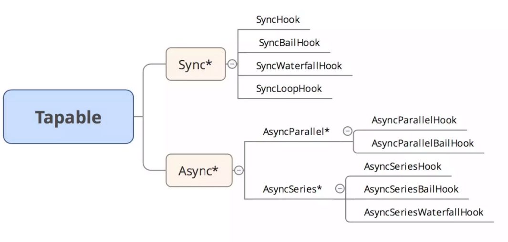
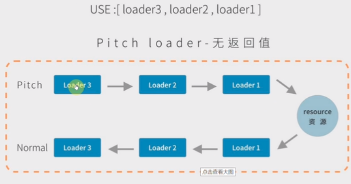
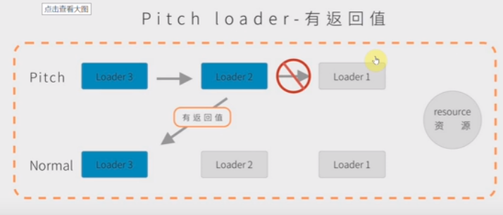

## 5 Tapable

[视频地址](https://www.bilibili.com/video/BV1a4411e7Bz?p=28)

### 5.1 介绍

`Webpack` 本质上是一种事件流的机制，它的工作流程就是将各个插件串联起来，而实现这一切的核心就是`Tapable`，`Tapable`有点类似于`nodejs`中的`event`库，核心原理也是依赖于订阅发布模式。

Tapable库 提供了很多的钩子类, 这些类可以为插件创建钩子：

```js
const {
    SyncHook,
    SyncBailHook,
    SyncWaterfallHook,
    SyncLoopHook,
    AsyncParallelHook,
    AsyncParallelBailHook,
    AsyncSeriesHook,
    AsyncSeriesBailHook,
    AsyncSeriesWaterfallHook
 } = require("tapable");
```

+ `tapable`库中有三种注册方法

```js
tap // 同步方法
tapAsync(cb)
tapPromise() // 注册的是promise
call
callAsync
callPromise
```



### 5.2 同步方法的实现

#### 5.2.1 SyncHook

```js
const { SyncHook } = require('tapable')

class Lesson {
  constructor() {
    this.hooks = {
      arch: new SyncHook(['name'])
    }
  }
  tap() { // 注册监听函数
    this.hooks.arch.tap('node', name => {
      console.log('node', name)
    })
    this.hooks.arch.tap('vue', name => {
      console.log('vue', name)
    })
  }
  start() {
    this.hooks.arch.call('houfei')
  }
}

let lesson = new Lesson()
lesson.tap() // 注册2个事件
lesson.start() // 启动钩子
```


```js
// 同步钩子
class SyncHook { // 钩子是同步的
  constructor(args) { // args => ['name']
    this.tasks = []
  }
  tap(name, task) {
    this.tasks.push(task)
  }
  call(...args) {
    this.tasks.forEach( task => task(...args))
  }
}

let hook = new SyncHook(['name'])

hook.tap('node', name => {
  console.log('node', name)
})
hook.tap('vue', name => {
  console.log('vue', name)
})

hook.call('houfei')
```

#### 5.2.2 SyncBailHook

```js
// 同步保险（熔断）钩子
const { SyncBailHook } = require('tapable')

class Lesson {
  constructor() {
    this.hooks = {
      arch: new SyncBailHook(['name'])
    }
  }
  tap() { // 注册监听函数
    this.hooks.arch.tap('node', name => {
      console.log('node', name)
      return '不想学习了' // 返回值为undefined才会向下执行
    })
    this.hooks.arch.tap('vue', name => {
      console.log('vue', name)
    })
  }
  start() {
    this.hooks.arch.call('houfei')
  }
}

let lesson = new Lesson()
lesson.tap() // 注册2个事件
lesson.start() // 启动钩子
```

```js
// 同步保险（熔断）钩子
class SyncBailHook {
  constructor(args) { // args => ['name']
    this.tasks = []
  }
  tap(name, task) {
    this.tasks.push(task)
  }
  call(...args) {
    let ret // 当前函数的返回值
    let index = 0
    do {
      ret = this.tasks[index++](...args)
    } while(ret === undefined && index < this.tasks.length)
  }
}

let hook = new SyncBailHook(['name'])

hook.tap('node', name => {
  console.log('node', name)
  return '停止执行' // 返回值为undefined才会向下执行
})
hook.tap('vue', name => {
  console.log('vue', name)
})

hook.call('houfei')
```

#### 5.2.3 SyncWaterfallHook

```js
// 将2个 tap 产生关系
const { SyncWaterfallHook } = require('tapable')

class Lesson {
  constructor() {
    this.hooks = {
      arch: new SyncWaterfallHook(['name'])
    }
  }
  tap() { // 注册监听函数
    this.hooks.arch.tap('node', name => {
      console.log('node', name)
      return 'node 学会了'
    })
    this.hooks.arch.tap('vue', data => {
      console.log('vue', data)
    })
  }
  start() {
    this.hooks.arch.call('houfei')
  }
}

let lesson = new Lesson()
lesson.tap() // 注册2个事件
lesson.start() // 启动钩子
```

```js
// 同步保险（熔断）钩子
class SyncWaterfallHook {
  constructor(args) { // args => ['name']
    this.tasks = []
  }
  tap(name, task) {
    this.tasks.push(task)
  }
  call(...args) {
    let [first, ...other] = this.tasks
    let ret = first(...args)
    other.reduce((a,b) => {
      return b(a)
    }, ret)
  }
}

let hook = new SyncWaterfallHook(['name'])

hook.tap('node', name => {
  console.log('node', name)
  return 'node Ok'
})
hook.tap('vue', data => {
  console.log('vue', data)
  return 'vue Ok'
})
hook.tap('webpack', data => {
  console.log('webpack', data)
})
hook.call('houfei')
```

#### 5.2.4 SyncLoopHook

```js
// loop 循环 tap
// 同步遇到不返回 undefined 的函数要多次执行，直到返回 undefined
const { SyncLoopHook } = require('tapable')

class Lesson {
  constructor() {
    this.index = 0
    this.hooks = {
      arch: new SyncLoopHook(['name'])
    }
  }
  tap() { // 注册监听函数
    this.hooks.arch.tap('node', name => {
      console.log('node', name)
      return ++this.index === 3? undefined: '继续学习 node'
    })
    this.hooks.arch.tap('vue', data => {
      console.log('vue', data)
    })
  }
  start() {
    this.hooks.arch.call('houfei')
  }
}

let lesson = new Lesson()
lesson.tap() // 注册2个事件
lesson.start() // 启动钩子
```

```js
class SyncLoopHook {
  constructor(args) { // args => ['name']
    this.tasks = []
  }
  tap(name, task) {
    this.tasks.push(task)
  }
  call(...args) {
    this.tasks.forEach( task => {
      let ret
      do {
        ret = task(...args)
      } while(ret !== undefined)
    })
  }
}

let hook = new SyncLoopHook(['name'])
let total = 0
hook.tap('node', name => {
  console.log('node', name)
  return ++total === 3? undefined: '继续学习 node'
})
hook.tap('vue', name => {
  console.log('vue', name)
})
hook.tap('webpack', name => {
  console.log('webpack', name)
})

hook.call('houfei')
```


### 5.3 异步方法的实现

#### 5.3.1 AsyncParallelHook - tap

```js
// 异步并行的钩子
const { AsyncParallelHook } = require('tapable')
// 异步的钩子（串行）并行 需要等待所有并发的异步事件执行后再执行回调方法
// 注册方法 分为 tap方法 和 tapAsync 方法
class Lesson {
  constructor() {
    this.hooks = {
      arch: new AsyncParallelHook(['name'])
    }
  }
  tap() { // 注册监听函数
    this.hooks.arch.tapAsync('node', (name, cb) => {
      // cb 这个回调可以表示这个异步什么时候执行完
      setTimeout(() => {
        console.log('node', name)
        cb()
      },  1000)
    })
    this.hooks.arch.tapAsync('vue', (name, cb) => {
      setTimeout(() => {
        console.log('vue', name)
        cb()
      },  1000)
    })
  }
  start() {
    this.hooks.arch.callAsync('houfei', () => {
      console.log('异步执行结束')
    })
  }
}

let lesson = new Lesson()
lesson.tap() // 注册2个事件
lesson.start() // 启动钩子
```

```js
// 模拟实现
// 异步并行方法
class AsyncParallelHook {
  constructor(args) { // args => ['name']
    this.tasks = []
  }
  tapAsync(name, task) {
    this.tasks.push(task)
  }
  callAsync(...args) {
    let finalCallBack = args.pop() // 拿出最终的函数
    let index = 0
    let done = () => { // 原理 类似于 Promise.all()
      index++
      if(index === this.tasks.length) {
        finalCallBack()
      }
    }
    this.tasks.forEach( task => task(...args,  done))
  }
}

let hook = new AsyncParallelHook(['name'])

hook.tapAsync('node', (name, cb) => {
  setTimeout(() => {
    console.log('node', name)
    cb()
  },  1000)
})
hook.tapAsync('vue', (name, cb) => {
  setTimeout(() => {
    console.log('vue', name)
    cb()
  },  1000)
})

hook.callAsync('houfei', () => {
  console.log('模拟结束')
})
```


#### 5.3.2 AsyncParallelHook - tapPromise

```js
// 异步并行的钩子
const { AsyncParallelHook } = require('tapable')
// 异步的钩子（串行）并行 需要等待所有并发的异步事件执行后再执行回调方法
// 注册方法 分为 tap方法 和 tapAsync 方法
class Lesson {
  constructor() {
    this.hooks = {
      arch: new AsyncParallelHook(['name'])
    }
  }
  tap() { // 注册监听函数
    this.hooks.arch.tapPromise('node', (name) => {
      return new Promise((resolve, reject) => {
        setTimeout(() => {
          console.log('node', name)
          resolve()
        }, 1000)
      })
    })
    this.hooks.arch.tapPromise('vue', (name) => {
      return new Promise((resolve, reject) => {
        setTimeout(() => {
          console.log('vue', name)
          resolve()
        }, 1000)
      })
    })
  }
  start() {
    this.hooks.arch.promise('houfei').then(() => {
      console.log('异步执行结束')
    })
  }
}

let lesson = new Lesson()
lesson.tap() // 注册2个事件
lesson.start() // 启动钩子
```


```js
// 模拟实现
// 异步并行方法
class AsyncParallelHook {
  constructor(args) { // args => ['name']
    this.tasks = []
  }
  tapPromise(name, task) {
    this.tasks.push(task)
  }
  promise(...args) {
    let tasks = this.tasks.map(task => task(...args))
    return Promise.all(tasks)
  }
}

let hook = new AsyncParallelHook(['name'])

hook.tapPromise('node', (name) => {
  return new Promise((resolve, reject) => {
    setTimeout(() => {
      console.log('node', name)
      resolve()
    }, 1000)
  })
})
hook.tapPromise('vue', (name) => {
  return new Promise((resolve, reject) => {
    setTimeout(() => {
      console.log('vue', name)
      resolve()
    }, 1000)
  })
})

hook.promise('houfei').then(() => {
  console.log('模拟结束----')
})
```


#### 5.3.3 AsyncSeriesHook - tap

异步串行

```js
// 异步的钩子（串行）
const { AsyncSeriesHook } = require('tapable')
class Lesson {
  constructor() {
    this.hooks = {
      arch: new AsyncSeriesHook(['name'])
    }
  }
  tap() { // 注册监听函数
    this.hooks.arch.tapAsync('node', (name, cb) => {
      // cb 这个回调可以表示这个异步什么时候执行完
      setTimeout(() => {
        console.log('node', name)
        cb()
      },  1000)
    })
    this.hooks.arch.tapAsync('vue', (name, cb) => {
      setTimeout(() => {
        console.log('vue', name)
        cb()
      },  1000)
    })
  }
  start() {
    this.hooks.arch.callAsync('houfei', () => {
      console.log('异步串行执行结束')
    })
  }
}

let lesson = new Lesson()
lesson.tap() // 注册2个事件
lesson.start() // 启动钩子
```


```js
// 模拟实现
// 异步串行方法
class AsyncSeriesHook {
  constructor(args) { // args => ['name']
    this.tasks = []
  }
  tapAsync(name, task) {
    this.tasks.push(task)
  }
  callAsync(...args) {
    let finalCallBack = args.pop() // 拿出最终的函数
    let index = 0
    let next = () => {
      if(this.tasks.length === index) return finalCallBack()
      let task = this.tasks[index++]
      task(...args, next)
    }
    next()
  }
}

let hook = new AsyncSeriesHook(['name'])

hook.tapAsync('node', (name, cb) => {
  setTimeout(() => {
    console.log('node', name)
    cb()
  },  1000)
})
hook.tapAsync('vue', (name, cb) => {
  setTimeout(() => {
    console.log('vue', name)
    cb()
  },  1000)
})

hook.callAsync('houfei', () => {
  console.log('模拟结束')
})
```


#### 5.3.4 AsyncSeriesHook - tapPromise

```js
const { AsyncSeriesHook } = require('tapable')
class Lesson {
  constructor() {
    this.hooks = {
      arch: new AsyncSeriesHook(['name'])
    }
  }
  tap() { // 注册监听函数
    this.hooks.arch.tapPromise('node', (name) => {
      return new Promise((resolve, reject) => {
        setTimeout(() => {
          console.log('node', name)
          resolve()
        }, 1000)
      })
    })
    this.hooks.arch.tapPromise('vue', (name) => {
      return new Promise((resolve, reject) => {
        setTimeout(() => {
          console.log('vue', name)
          resolve()
        }, 1000)
      })
    })
  }
  start() {
    this.hooks.arch.promise('houfei').then(() => {
      console.log('异步执行结束')
    })
  }
}

let lesson = new Lesson()
lesson.tap() // 注册2个事件
lesson.start() // 启动钩子
```


```js
// 异步并行方法
class AsyncSeriesHook {
  constructor(args) { // args => ['name']
    this.tasks = []
  }
  tapPromise(name, task) {
    this.tasks.push(task)
  }
  promise(...args) {
    let tasks = this.tasks.map(task => task(...args))
    return Promise.all(tasks)
  }
}

let hook = new AsyncSeriesHook(['name'])

hook.tapPromise('node', (name) => {
  return new Promise((resolve, reject) => {
    setTimeout(() => {
      console.log('node', name)
      resolve()
    }, 1000)
  })
})
hook.tapPromise('vue', (name) => {
  return new Promise((resolve, reject) => {
    setTimeout(() => {
      console.log('vue', name)
      resolve()
    }, 1000)
  })
})

hook.promise('houfei').then(() => {
  console.log('模拟结束----')
})
```


### 5.3.5 AsyncSeriesWaterfallHook -tap

```j
// 异步的钩子（串行）
const { AsyncSeriesWaterfallHook } = require('tapable')
class Lesson {
  constructor() {
    this.hooks = {
      arch: new AsyncSeriesWaterfallHook(['name'])
    }
  }
  tap() { // 注册监听函数
    this.hooks.arch.tapAsync('node', (name, cb) => {
      // cb 这个回调可以表示这个异步什么时候执行完
      setTimeout(() => {
        console.log('node', name)
        // cb(null, 'result')
        cb('error', 'result') // 会跳过下一个钩子，直接执行最后的 hook
      },  1000)
    })
    this.hooks.arch.tapAsync('vue', (data, cb) => {
      setTimeout(() => {
        console.log('vue', data)
        cb()
      },  1000)
    })
  }
  start() {
    this.hooks.arch.callAsync('houfei', () => {
      console.log('异步串行执行结束')
    })
  }
}

let lesson = new Lesson()
lesson.tap() // 注册2个事件
lesson.start() // 启动钩子
```


```js
// 模拟实现
// 异步串行方法
class AsyncSeriesHook {
  constructor(args) {
    // args => ['name']
    this.tasks = []
  }
  tapAsync(name, task) {
    this.tasks.push(task)
  }
  callAsync(...args) {
    let finalCallBack = args.pop() // 拿出最终的函数
    let index = 0
    let next = (err, data) => {
      let task = this.tasks[index]
      if (!task) return finalCallBack()
      if (index === 0) {
        task(...args, next)
      } else {
        task(data, next)
      }
      index++
    }
    next()
  }
}

let hook = new AsyncSeriesHook(['name'])

hook.tapAsync('node', (name, cb) => {
  setTimeout(() => {
    console.log('node', name)
    cb(null, '第一个结果')
  }, 1000)
})
hook.tapAsync('vue', (data, cb) => {
  setTimeout(() => {
    console.log('vue', data)
    cb(null)
  }, 1000)
})

hook.callAsync('houfei', () => {
  console.log('模拟结束')
})

```

## 6 手写Webpack

详见 `06-my-webpack` 文件 以及 (视频)[https://www.bilibili.com/video/av51693431?p=33]

## 7 loader

### 7.1 pitchLoader 和 normalLoader

每个loader都有两部分组成 `pitchLoader` 和 `normalLoader`，pitch和normal的执行顺序正好相反，当pitch没有定义或者没有返回值时，会先依次执行pitch在获取资源执行loader，如果定义的某个pitch有返回值则会跳过读取资源和自己的loader。





### 7.2 loader 的特点

+ 每一个loader要返回js脚本
+ 每一个loader只做一件内容，为了使loader在更多场景链式调用
+ 每一个loader都是一个模块
+ 每一个loader都是无状态的，确保loader在不同模块转换之间不保存状态

## 8 实现 babel-loader

安装babel和babel相关的插件

```bash
npm i @babel/core babel-loader @babel/preset-env
```

babel-loader配置

```js
// webpack.config.js
const path = require('path')
module.exports = {
  mode: 'development',
  entry: './src/index',
  output: {
    filename: 'build.js',
    path: path.resolve(__dirname, 'dist')
  },
  devtool: 'source-map',
  resolveLoader: {
    modules: [
      'node_modules',
      path.resolve(__dirname, 'loaders')
    ]
  },
  module: {
    rules: [
      {
        test: /\.js$/,
        use: {
          loader: 'babel-loader',
          options: {
            presets: [
              '@babel/preset-env'
            ]
          }
        }
      }
    ]
  }
}

```

```js
// package.json
{
  "name": "08-babel-loader",
  "version": "1.0.0",
  "description": "",
  "main": "index.js",
  "scripts": {
    "test": "echo \"Error: no test specified\" && exit 1"
  },
  "keywords": [],
  "author": "",
  "license": "ISC",
  "devDependencies": {
    "@babel/core": "^7.7.7",
    "@babel/preset-env": "^7.7.7",
    "webpack": "^4.41.5",
    "webpack-cli": "^3.3.10"
  },
  "dependencies": {
    "loader-utils": "^1.2.3"
  }
}
```

```js
// loaders/babel-loader.js
const babel = require('@babel/core')
const loaderUtils = require('loader-utils')

function loader(source) { // this
  let options = loaderUtils.getOptions(this)
  let cb = this.async()
  babel.transform(source,{
    ...options,
    sourceMaps: true,
    filename: this.resourcePath.split('/').pop(), // 文件名
  },(err, result) => {
    cb(err, result.code, result.map)
  })
}

module.exports = loader
```

执行 `npx webpack`

## 9 手写bannner-loader

```js
// webpack.config.js
const path = require('path')
module.exports = {
  mode: 'development',
  entry: './src/index',
  output: {
    filename: 'build.js',
    path: path.resolve(__dirname, 'dist')
  },
  devtool: 'source-map',
  resolveLoader: {
    modules: [
      'node_modules',
      path.resolve(__dirname, 'loaders')
    ]
  },
  watch: true,
  module: {
    rules: [
      {
        test: /\.js$/,
        use: {
          loader: 'banner-loader',
          options: {
            text: '注释文案',
            filename: path.resolve(__dirname, 'src', 'banner.js')
          }
        }
      }
    ]
  }
}

```

```js
// banner-loader
const loaderUtils = require('loader-utils')
const validateOptions = require('schema-utils')
const fs = require('fs')
function loader(source) {
  this.cacheable && this.cacheable()
  // this.cacheable(false) // webpack 打包自动添加缓存， false则不添加缓存 当有大量计算时，webpack建议添加缓存
  // this
  let options = loaderUtils.getOptions(this)
  let cb = this.async()
  let schema = {
    type: 'object',
    properties: {
      text: {
        type: 'string'
      },
      filename: {
        type: 'string'
      }
    }
  }
  validateOptions(schema, options, 'banner-loader')
  if(options.filename) {
    this.addDependency(options.filename) // 自动添加文件依赖
    fs.readFile(options.filename, 'utf8', (err,data) => {
      cb(err,`/**${data}*/${source}`)
    })
  } else {
    cb(null,`/**${options.text}*/${source}`)
  }
}

module.exports = loader

```

```js
// package.json
{
  "name": "08-babel-loader",
  "version": "1.0.0",
  "description": "",
  "main": "index.js",
  "scripts": {
    "test": "echo \"Error: no test specified\" && exit 1"
  },
  "keywords": [],
  "author": "",
  "license": "ISC",
  "devDependencies": {
    "@babel/core": "^7.7.7",
    "@babel/preset-env": "^7.7.7",
    "schema-utils": "^2.6.1",
    "webpack": "^4.41.5",
    "webpack-cli": "^3.3.10"
  },
  "dependencies": {
    "loader-utils": "^1.2.3"
  }
}

```

## 10 手写url-loader

```js
const loaderUtils = require('loader-utils')
const mime = require('mime')
function loader(source) { // this
  let {limit} = loaderUtils.getOptions(this)
  if(limit && limit > source.length) {
    return `module.exports = "data:${mime.getType(this.resourcePath)};base64,${source.toString('base64')}"`
  } else {
    console.log(111)
    return require('./file-loader.js').call(this, source)
  }
}
loader.raw = true
module.exports = loader
```

```js
// webpack.config.js
const path = require('path')
module.exports = {
  mode: 'development',
  entry: './src/index',
  output: {
    filename: 'build.js',
    path: path.resolve(__dirname, 'dist')
  },
  devtool: 'source-map',
  resolveLoader: {
    modules: ['node_modules', path.resolve(__dirname, 'loaders')]
  },
  watch: true,
  module: {
    rules: [
      {
        test: /\.jpg$/,
        use: {
          // 目的就是根据图片生产一个md5戳，发射到dist目录下，file-loader还会返回当前的图片路径
          // url-loader 第一步， 会处理路径交给file-loader处理
          loader: 'url-loader',
          options: {
            limit: 50 * 1024
          }
        }
      },
      {
        test: /\.js$/,
        use: {
          loader: 'banner-loader',
          options: {
            text: '注释文案',
            filename: path.resolve(__dirname, 'src', 'banner.js')
          }
        }
      }
      // {
      //   test: /\.js$/,
      //   use: {
      //     loader: 'babel-loader',
      //     options: {
      //       presets: [
      //         '@babel/preset-env'
      //       ]
      //     }
      //   }
      // }
    ]
  }
}
```

```js
// src/index.js
import pic from './img/0.jpg'
let img = document.createElement('img')
img.src = pic
document.body.appendChild(img)
```

## 10 style-loader css-loader less-loader

```js
// style-loader
const loaderUtils = require('loader-utils')
function loader(source) {
  // 导出一个脚本
  let str = `
    let style = document.createElement('style')
    style.innerHTML= ${JSON.stringify(source)}
    document.head.appendChild(style)
  `
  return str
}
// pitch 不在执行之后的loader了
loader.pitch = function(remainingRequest) {
  // console.log(remainingRequest) // C:\Users\.....\css-loader.js!C:\Users\....\less-loader.js!C:\Users\...src\index.less
  // 让 style-loader 去处理 remainingRequest 的loader问题
  // loaderUtils.stringifyRequest 转化为相对路径
  let str = `
    let style = document.createElement('style')
    style.innerHTML= require(${loaderUtils.stringifyRequest(this, '!!' + remainingRequest)})
    console.log('111', style.innerHTML)
    document.head.appendChild(style)
  `
  return str
}
module.exports = loader

```

```js
// css-loader
function loader(source) {
  let reg = /url\((.+?)\)/g
  let pos = 0
  let current
  let arr = ['let list = [];']
  while(current = reg.exec(source)) {
    let [matchUrl, g] = current
    // console.log(matchUrl, g)
    let last = reg.lastIndex - matchUrl.length
    arr.push(`list.push(${JSON.stringify(source.slice(pos, last))})`)
    pos = reg.lastIndex
    // 把 g 替换为 require 的写法
    arr.push(`list.push("url("+require(${g})+")")`)
  }
  arr.push(`list.push(${JSON.stringify(source.slice(pos))})`)
  arr.push(`module.exports = list.join('')`)
  console.log(arr.join('\r\n'))
  return arr.join('\r\n')
}
module.exports = loader
```

```js
// less-loader
const less = require('less')
function loader(source) {
  let css
  less.render(source, function(err, r) {
    css = r.css
  })
  return css
}
module.exports = loader
```

```js
// webpack.config.js
rules: [
  {
    test: /\.less$/,
    use: ['style-loader', 'css-loader', 'less-loader']
  }
```

## 11 my-webpack-plugin

```js
// webpack.config.js
const path = require('path')
const DonePlugin = require('./plugins/DonePlugin.js')
const AsyncPlugin = require('./plugins/AsyncPlugin.js')
module.exports = {
  mode: 'development',
  entry: './src/index',
  output: {
    filename: 'build.js',
    path: path.resolve(__dirname, 'dist')
  },
  plugins: [
    new DonePlugin(),
    new AsyncPlugin(),
  ]
}

```

### 11.1 同步的插件

```js
// ./plugins/DonePlugin.js
class DonePlugin {
  apply(compiler) {
    console.log(1)
    compiler.hooks.done.tap('DonePlugin', (stats) => {
      console.log('编译完成')
    })
  }
}

module.exports = DonePlugin
```

### 11.2 异步的插件

```js
// ./plugins/AsyncPlugin.js
class AsyncPlugin {
  apply(compiler) {
    console.log(2)
    compiler.hooks.emit.tapAsync('AsyncPlugin', (compliation, cb) => {
      setTimeout(() => {
        console.log('文件发射完成 等1s')
        cb()
      }, 1000)
    })
    compiler.hooks.emit.tapPromise('AsyncPlugin', (compliation) => {
      return new Promise((resolve, reject) => {
        setTimeout(() => {
          console.log('文件发射完成 在等1s')
          resolve()
        }, 1000)
      }) 
    })
  }
}

module.exports = AsyncPlugin
```

### 11.3 文件列表插件

```js
// FileListPlugin.js
class FileListPlugin {
  constructor({filename}) {
    this.filename = filename
  }
  apply(compiler) {
    // 文件路径
    // 文件已经准备好了
    compiler.hooks.emit.tap('FileListPlugin', (compilcation) => {
      // console.log(compilcation.assets)
      let assets = compilcation.assets
      let content = `| 文件名    | 资源大小    |\r\n| ---- | ---- | ---- |\r\n`
      Object.entries(assets).forEach(([filename, statObj]) => {
        content += `| ${filename}    | ${statObj.size()/1024}kb    |\r\n`
      })
      assets[this.filename] = {
        source() {
          return content
        },
        size() {
          return content.length
        }
      }
    })
  }
}

module.exports = FileListPlugin
```

```js
// webpack.config.js
const path = require('path')
const HtmlWebpackPlugin = require('html-webpack-plugin')
const FileListPlugin = require('./plugins/FileListPlugin.js')
module.exports = {
  mode: 'development',
  entry: './src/index.js',
  output: {
    filename: 'build.js',
    path: path.resolve(__dirname, 'dist')
  },
  plugins: [
    new HtmlWebpackPlugin({
      template: './src/index.html'
    }),
    new FileListPlugin({
      filename: "list.md"
    })
  ]
}

```

## 12 内联webopack插件

```js
// InlineSourcePlugin.js
// 把html页面外联的标签变成内联的标签
const HtmlWebpackPlugin = require('html-webpack-plugin')
class InlineSourcePlugin {
  constructor({match}) {
    this.match = match // 正则
  }
  // 处理每一个标签的数据
  processTag(tag, compilation) {
    console.log(tag)
    let newTag,url
    if(tag.tagName === 'link' && this,this.match.test(tag.attributes.href)) {
      newTag = {
        tagName: 'style',
        attributes: {
          type: 'text/css'
        }
      }
      url = tag.attributes.href
    }
    if(tag.tagName === 'script' && this,this.match.test(tag.attributes.src)) {
      newTag = {
        tagName: 'script',
        attributes: {
          type: 'application/javascript'
        }
      }
      url = tag.attributes.src
    }
    if(url) {
      // 将文件内容放在innerHTML属性上
      newTag.innerHTML = compilation.assets[url].source()
      delete compilation.assets[url] // 删除掉原有资源
      return newTag
    }
    return tag
  }
  // 处理引入标签的数据
  processTags(data, compilation) {
    let headTags = []
    let bodyTags = []
    data.headTags.forEach(headTag => {
      headTags.push(this.processTag(headTag, compilation))
    });
    data.bodyTags.forEach(bodyTag => {
      bodyTags.push(this.processTag(bodyTag, compilation))
    })
    return {...data, headTags, bodyTags}
  }
  apply(compiler) {
    // 通过webpackPlugin实现这个功能
    compiler.hooks.compilation.tap('InlineSourcePlugin', compilation => {
      console.log(HtmlWebpackPlugin)
      HtmlWebpackPlugin.getHooks(compilation).alterAssetTagGroups.tapAsync('alterPlugin', (data, cb) => {
        // console.log(data)
        data = this.processTags(data, compilation)
        cb(null, data)
      })
    })
  }
}

module.exports = InlineSourcePlugin
```

```js
// webpack.config.js
new InlineSourcePlugin({
  match: /\.(js|css)/
})
```
